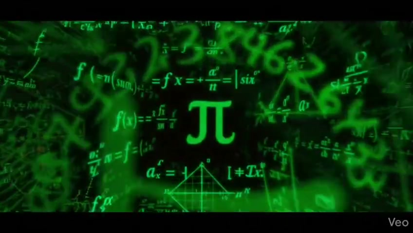

  <a href="./assets/profile-banner.mp4" title="Open HD animation">
    <picture>
      <source srcset="./assets/profile-banner.webp" type="image/webp" />
      
    </picture>
  </a>

<em>Click the banner to view the HD animation</em>

  

<em>aka <code>$#!√@π$#U</code></em>

  <strong>AI Engineer | Machine Learning | Deep Learning | Data Science</strong>

  

  
  
  

  
  
  

## AI Engineer Snapshot

I build practical AI systems that combine strong modeling with clean implementation.
My work spans machine learning, deep learning, and AI engineering projects with real datasets and clear outcomes.

- Current focus: deep learning workflows, applied NLP/CV, and AI agent projects.
- Collaboration interests: ML products, intelligent automation, and research-to-product builds.
- Contact: `22083903000@reck.ac.in`

## What I Build

| Domain | Approach |
| --- | --- |
| Machine Learning | End-to-end pipelines, feature engineering, model evaluation, and iterative improvement |
| Deep Learning | Neural models for vision/NLP tasks using modern training workflows |
| AI Engineering | Reproducible project structure, practical experimentation, and deployment-ready thinking |
| Problem Solving | Consistent DSA practice and algorithmic reasoning |

## Featured Projects

  
  

  
  

## Tech Stack

### Languages

  
  
  

### ML and DL

  
  
  
  
  
  

### Engineering Tools

  
  
  

## Coding Profiles

  
  
  

## GitHub Performance

  
  

  

  

  

## Contribution Animation

  

## Collaboration

If you are building in AI, ML, DL, NLP, or computer vision, I am always open to meaningful collaboration and high-impact ideas.

---

  <em>From models to impact, one project at a time.</em>

